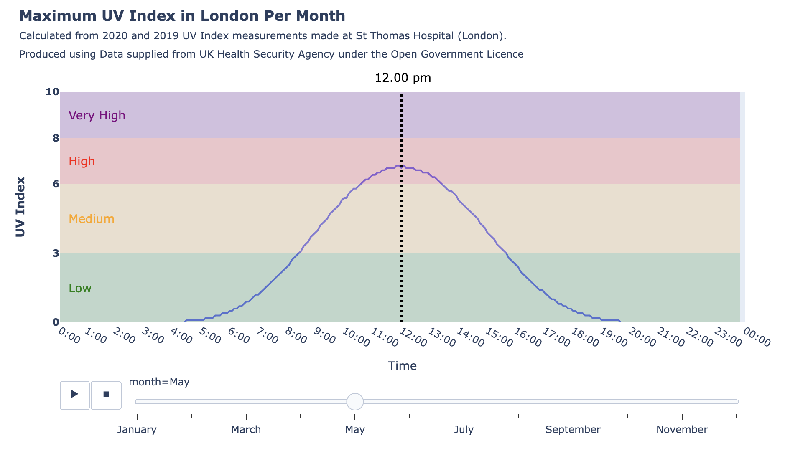

# Max UV Index Curve London

**Click on image below to view full interactive UV index plot**

[here](https://htmlpreview.github.io/?https://github.com/rhart-rup/UV-Index-Curve-London/blob/main/london_UV_curve.html)

- In this project, we created...blah...it could be used for example to blumble...
- A screenshot of the plot is shown below - **Click it** to view the full interactive plot.
- See the blah.ipynb to view the full motivation for the project and steps used to clean, format and plot the data.
- UV Index Data made by blah from blah...
